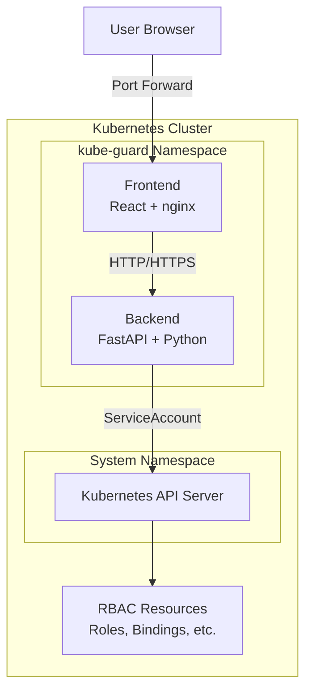
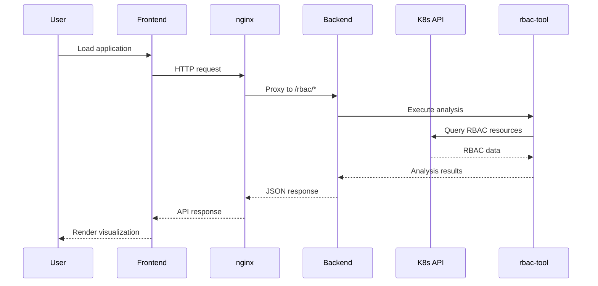
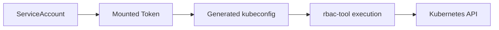

# Architecture Documentation

## System Overview

KubeGuard is a cloud-native RBAC security analysis platform designed for Kubernetes environments, implementing a microservices architecture with real-time analysis capabilities.

## High-Level Architecture



## Component Architecture

### Frontend Architecture
```
frontend/
├── public/              # Static assets
├── src/
│   ├── components/      # React components
│   │   ├── graph/       # D3.js visualizations
│   │   ├── tables/      # Data tables
│   │   └── common/      # Shared components
│   ├── services/        # API communication
│   ├── stores/          # Zustand state management
│   ├── types/           # TypeScript definitions
│   └── utils/           # Utility functions
└── nginx.conf           # Reverse proxy configuration
```

**Technology Stack:**
- **React 18**: Component-based UI
- **TypeScript**: Type safety
- **D3.js**: Graph visualizations
- **Zustand**: State management
- **nginx**: Reverse proxy and static serving

### Backend Architecture
```
backend/
├── app/
│   ├── api/             # FastAPI routes
│   │   └── rbac/        # RBAC endpoints
│   ├── models/          # Pydantic models
│   ├── services/        # Business logic
│   │   └── rbac_service.py
│   ├── core/            # Configuration
│   └── main.py          # Application entry
├── requirements.txt     # Dependencies
└── Dockerfile          # Container definition
```

**Technology Stack:**
- **FastAPI**: High-performance API framework
- **Pydantic**: Data validation and serialization
- **rbac-tool**: Kubernetes RBAC analysis
- **Kubernetes Python client**: Cluster interaction

## Data Flow Architecture

### Request Flow


### Data Processing Pipeline
1. **Collection**: rbac-tool queries Kubernetes API
2. **Processing**: Backend transforms data to standard format
3. **Analysis**: Security findings generation
4. **Serialization**: Pydantic model validation
5. **Transport**: REST API with JSON
6. **Visualization**: D3.js graph rendering

## Deployment Architecture

### Kubernetes Deployment
```yaml
# Simplified deployment structure
apiVersion: apps/v1
kind: Deployment
spec:
  template:
    spec:
      serviceAccount: kube-guard
      containers:
      - name: backend
        securityContext:
          runAsNonRoot: true
      - name: frontend
        ports:
        - containerPort: 80
```

### Helm Chart Structure
```
helm/kube-guard/
├── Chart.yaml           # Chart metadata
├── values.yaml          # Default configuration
└── templates/
    ├── rbac.yaml        # ServiceAccount, Role, RoleBinding
    ├── deployment.yaml  # Backend/Frontend deployments
    ├── service.yaml     # Service definitions
    └── ingress.yaml     # Optional ingress
```

## Security Architecture

### Authentication Flow


### Permission Model
- **Namespace**: Dedicated `kube-guard` namespace
- **ServiceAccount**: Custom SA with minimal permissions
- **ClusterRole**: Read-only RBAC resource access
- **Network**: Internal cluster communication only

## Performance Architecture

### Scalability Patterns
- **Horizontal scaling**: Multiple backend replicas
- **Caching**: In-memory response caching
- **Batch processing**: Bulk policy rule queries
- **Async operations**: Non-blocking I/O

### Performance Characteristics
```yaml
Resource Requirements:
  Backend:
    CPU: 100m-500m
    Memory: 128Mi-512Mi
  Frontend:
    CPU: 50m-200m
    Memory: 64Mi-256Mi
```

## Integration Architecture

### External Dependencies
- **Kubernetes API**: Cluster state source
- **rbac-tool**: Analysis engine
- **Container Runtime**: Docker/containerd

### API Design
```yaml
REST API Endpoints:
- GET /rbac/bindings       # List all RBAC bindings
- GET /rbac/analysis       # Security analysis results
- GET /rbac/policy-rules   # Subject permissions
- POST /rbac/policy-rules/batch  # Bulk queries
- GET /health              # Health check
- GET /ready               # Readiness check
```

---

**Architecture Version**: v1.0.0  
**Last Updated**: July 2025  
**Author**: Gerardo Zapico